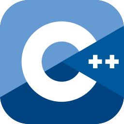

#  Yo! I'm Owen 

**`Software Engineer`**   
 Currently completing a MS in CS, with a focus in machine learning.

#

<!-- MY TECH STACK -->
###  My Tech Stack

<table>
  <tbody>
    <tr>
      <!-- LANGUAGES -->
      <td width="333px" valign="top">
        

          <b> Languages</b>
        

        

            
            
            
            
            
        

      </td>
      <!-- TOOLS -->
      <td width="333px" valign="top">
        

          <b> Tools</b>
        

        

            
            
            
        

      </td>
      <!-- EXPLORING -->
      <td width="333px" valign="top">
        

          <b> Exploring</b>
        

        

            
             
             
        

      </td>
    </tr>
  </tbody>
</table>

#

