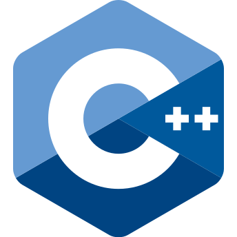

#  hi, I'm Owen

**`Software Engineer`**   
Avid AI user, currently working on completing a Master's program in Computer Science.

#

<!-- LANGUAGE & TOOLS -->
###  Languages & Tools

  
  
  
  
  
  
  
  
  

 

#

<!-- CURRENTLY EXPLORING -->
###  Currently Exploring

  
  
  
 

#

